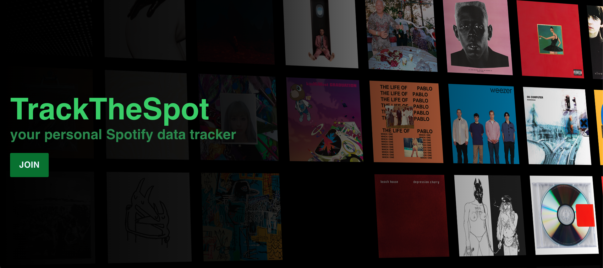
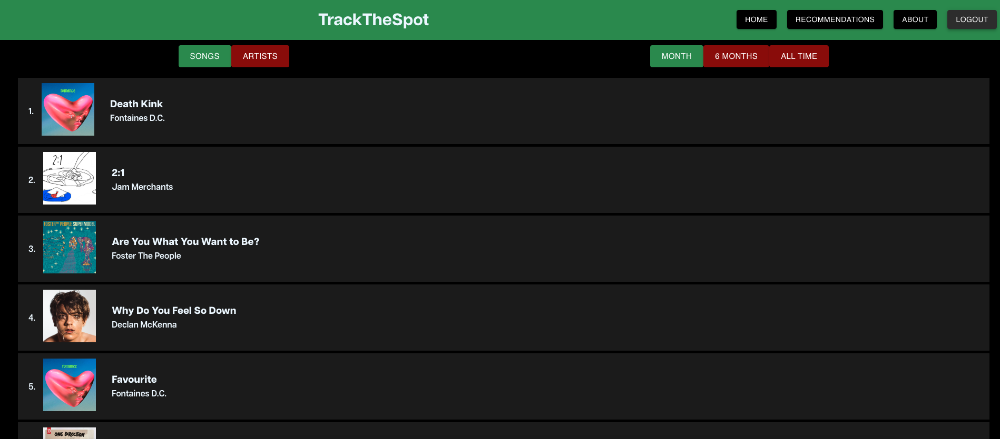
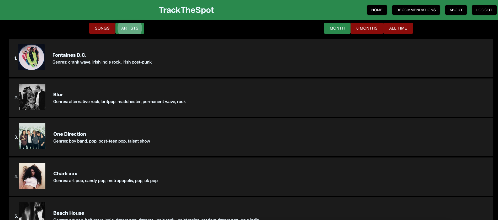
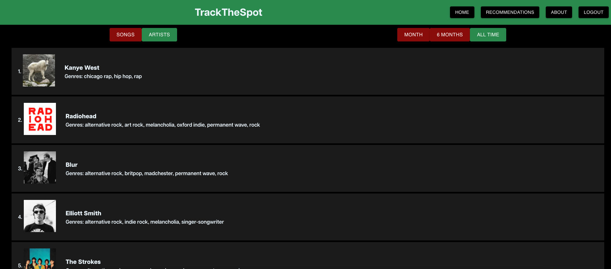

# wrappedly

wrappedly is a personal Spotify data tracker that allows users to explore their top tracks and artists. The app is designed to offer insights into your listening habits, featuring a dynamic interface for discovering trends over different time periods.

## Features

- **Top Tracks & Artists**: View your most played songs and artists.
- **Dynamic Time Range**: Toggle between different time ranges (Last Month, 6 Months, All Time) to see how your preferences evolve.
- **Interactive Interface**: Intuitive navigation with material design components.
- **User Authentication**: Secure Spotify login via OAuth for personalized data tracking.
- **Recommendations**: Placeholder for song recommendations (currently disabled on the hosted version).

## Project Structure

The main components of the project include:

1. **Landing Page**: User login and introduction to the app.
2. **Home Page**: Display top tracks and artists with filters for time range and data type.
3. **Recommendations Page**: Placeholder for future recommendation features.
4. **About Page**: Information about the creator and links to learn more.

### Key Files

- `App.js`: Main app structure and route management.
- `Landing.js`: Handles Spotify authentication.
- `Home.js`: Main data display and filtering logic.
- `RecPage.js`: Placeholder for recommendations.
- `Artist.js` and `Song.js`: Components for rendering individual items.
- `Table.js`: Renders lists of songs or artists based on user preferences.

### Home Page

### Top Tracks

### Top Artists

## Getting Started

### Prerequisites

- A Spotify account.
- A registered Spotify application to obtain the Client ID and Redirect URI.
